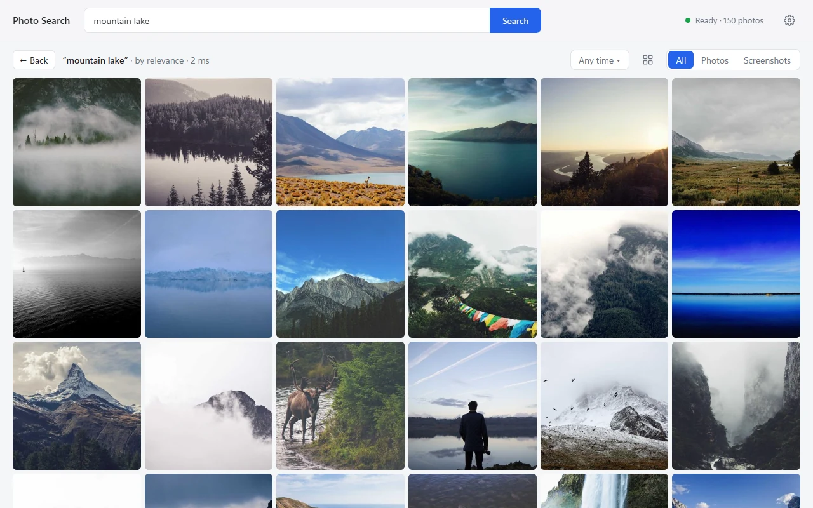
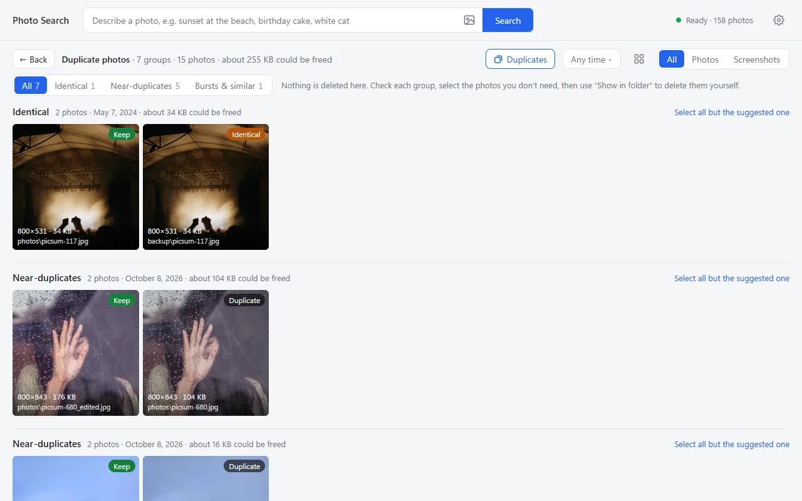

# Local Photo Search — offline AI photo search with EmbeddingGemma 2

[](https://github.com/zkwi/local-photo-search/releases/latest)
[](https://github.com/zkwi/local-photo-search/actions/workflows/ci.yml)


[](LICENSE)

English | [简体中文](README.zh-CN.md)

**Local Photo Search** is a free, open-source desktop app that finds photos on your own computer by what is in them.
Type “sunset at the beach”, “birthday cake May last year” or “chat screenshot” and matching photos appear in a fraction of a second.
You can also search by image — drop or paste a picture to find the same or similar photos — and review duplicate photos to free up space.
It works like the search in Google Photos or Apple Photos, but everything runs locally with Google's multimodal embedding model
**[EmbeddingGemma 2](https://huggingface.co/google/embeddinggemma-2)** — your photos are never uploaded, and no account or internet connection is needed after setup.



## Download and run

1. Download `LocalPhotoSearch-<version>-windows-x64.zip` from the [latest release](https://github.com/zkwi/local-photo-search/releases/latest).
2. Extract it to a normal folder, such as `D:\Apps` or your user folder (not `Program Files`, which is read-only).
3. Double-click **Local Photo Search.exe**. In mainland China, use **Start with China mirrors.cmd** for the first launch.

The first launch sets everything up by itself: it downloads Python and PyTorch (about 3 GB) and then the EmbeddingGemma 2 model (about 1.5 GB), showing progress as it goes. This happens once and took about 6 minutes in our test; you can already add your photo folders while the model downloads.
Later launches show your photos in about 2 seconds and are ready to search in about 15.

Windows may show “Windows protected your PC” because the app isn't code-signed: click **More info → Run anyway**.

**Upgrading**: close the app, extract the new zip to the same place and let it replace the old files. Your index, settings and Python environment are kept; if the new version needs other Python packages, its first launch updates them automatically.

## Features

- **Natural-language photo search**: describe a scene, an object, a color or a moment, in English, Chinese or another language the model understands. Results are ranked by semantic similarity; filter to photos or to screenshots.
- **Dates in the query**: “beach May 2025”, “cat past 30 days” or “去年5月 海边” become a date filter; a date on its own browses that period.
- **Search by image**: drop a picture into the window, paste one with Ctrl+V, or pick a file with the image button in the search box. Handy for finding the original of a photo someone sent you: it comes first and is labeled **Same photo**.
- **Duplicate photos**: review identical files, near-duplicates (resized or compressed copies such as ones saved from a chat app, edited versions, bursts with no visible difference) and burst shots group by group, with a suggested photo to keep and each file's resolution, size and folder. Screenshots are only flagged when the files are identical. The app never deletes anything: select the photos you don't need and use **Show in folder** to delete them yourself.
- **Find similar photos** from any photo in your library, and **browse by month** — click a month to see only it, or open **Photos from this day** from any photo. Burst shots and duplicates are folded into one tile and can be stepped through in the preview.
- **Preview**: zoom into the original (click, or Ctrl+scroll), slideshow, full screen, copy the image (Ctrl+C), show it in its folder. Right-click a photo for these actions anywhere in the app.
- **Organize**: select several photos (Ctrl/Shift+click, Ctrl+A), then copy their paths, show them in File Explorer or export copies to a folder.
- **Your library, your folders**: add folders in Settings or drag them into the window; NAS and external drives that may be offline are fine; JPG, PNG, WebP, BMP and HEIC. New, changed and deleted photos are picked up at startup, and the first indexing shows photos as it goes.
- **Interface in English and Simplified Chinese**, following your system language.

Your photo folders are only read — nothing is modified or moved, and export makes copies. Press `?` in the app for keyboard shortcuts.



## Why EmbeddingGemma 2?

Text-to-image search needs a model that puts photos and sentences into the same vector space. Many tools use CLIP for this; Local Photo Search uses Google's EmbeddingGemma 2 because it:

- encodes **images and text with one multimodal model**, so a sentence can be compared directly with every photo;
- is **multilingual**, so queries in Chinese work as well as queries in English;
- is **small enough for a normal PC**: 744M parameters, about 1.5 GB to download, about 1.5 GB of GPU memory, and it also runs on the CPU;
- is released under the **Apache 2.0** license.

## System requirements

- **Windows 10 or 11**, 64-bit, with WebView2 (built into Windows 11 and kept up to date on Windows 10) and the [Microsoft Visual C++ Redistributable](https://aka.ms/vs/17/release/vc_redist.x64.exe) that PyTorch needs (most PCs already have it; if it's missing, the app tells you).
- **GPU (optional)**: an NVIDIA GTX 16 / RTX 20 series card or newer with 3 GB+ of memory and a recent driver (R580 or later) is recommended (measured: about 1.5 GB after loading, 2.4 GB peak while indexing). Older NVIDIA cards and other GPUs are skipped automatically and the app uses the CPU.
  Without one the app runs on the CPU. Searching is just as fast, but the first indexing is slower: about 0.05 s per photo on an RTX 4080 SUPER versus about 2 s on a Core Ultra 7 265K CPU.
- **Disk**: about 3.3 GB for the Python environment, 1.5 GB for the model, and 30 MB per 1,000 photos for the index and thumbnails. The model and uv's package cache (about 3 GB) are kept in your user profile on drive C:, wherever the app folder is.
- **Internet** only for the first launch.

## FAQ

**Does it upload my photos?** No. Photos, thumbnails and the search index stay on your computer. The network is only used on the first launch, to download Python packages and the model.

**Does it work offline?** Yes, after the first launch has finished downloading.

**Do I need an NVIDIA GPU?** No. Without one, or with an NVIDIA card older than the GTX 16 series, it runs on the CPU; search stays fast and only the first indexing takes longer (see above).

**Which languages can I search in?** Any language EmbeddingGemma 2 understands; English and Chinese have been tested the most. The interface itself is in English and Simplified Chinese.

**The first launch is slow or fails in mainland China.** Start the app with **Start with China mirrors.cmd**: it downloads Python from npmmirror and the model from hf-mirror.com. The Python packages themselves come from files.pythonhosted.org and download.pytorch.org (download-r2.pytorch.org); if those are blocked on your network, set a proxy with the `HTTPS_PROXY` environment variable. After the first launch, no downloads are needed.

**“Setting up the Python environment failed”.** It's usually the network. Fix it, then click **Restart background service** in the banner; packages that were already downloaded are not downloaded again.

**Can it find text or names in screenshots?** The model reads some of the text in screenshots, but exact names or numbers are hit-and-miss because there is no OCR.

**Why does a burst show up as one photo?** Photos that look nearly the same and were taken within 10 minutes of each other form a group. Lists show one photo per group; open it to step through the rest.

**Does it delete duplicates for me?** No. The app never deletes, moves or changes your photos. **Duplicates** only lists them: select the ones you don't need, click **Show in folder**, and delete them in File Explorer (they go to the Recycle Bin). The suggested photo to keep is simply the one with the highest resolution, then the largest file — check each group before deleting.

**Which images can I search with?** JPEG, PNG, WebP, BMP, GIF and HEIC, up to 50 MB. The picture doesn't need to be in your library; it is only used for that search and is not saved.

**The interface is in the wrong language.** It follows your Windows display language. Change it in Settings → Language.

## Privacy

- Photos, thumbnails and the index stay on your computer (in the app's `index` folder) and are never uploaded.
- Recent searches are kept only in the app's local data on this computer; remove them one by one from the search box dropdown.
- The app never checks for updates by itself. **Settings → Check for updates** just opens the releases page in your browser.
- The `index` folder holds thumbnails (low-resolution copies of your photos) and `config.json` holds your folder paths, so don't share them.
- The background service only accepts requests from this computer, and the app window can only load local content. See [SECURITY.md](SECURITY.md) for details and how to report a vulnerability.

## Uninstall

Close the app and delete its folder. To also free the shared downloads, delete the model cache at `%USERPROFILE%\.cache\huggingface\hub\models--google--embeddinggemma-2` and the app data at `%LOCALAPPDATA%\io.github.zkwi.local-photo-search` and `%APPDATA%\io.github.zkwi.local-photo-search`; if you don't use uv for anything else, also delete its package cache (`%LOCALAPPDATA%\uv`) and the Python it installed (`%APPDATA%\uv`).

## Build from source

You need [uv](https://docs.astral.sh/uv/), Node.js 22 or later, Rust, and the system components Tauri needs (on Windows: Microsoft C++ Build Tools and WebView2) — see the [Tauri prerequisites](https://tauri.app/start/prerequisites/).

```powershell
git clone https://github.com/zkwi/local-photo-search.git
cd local-photo-search
cd app
npm ci
npx tauri build         # the first build takes a few minutes
.\src-tauri\target\release\local-photo-search.exe
```

Like the release package, the app sets up the Python environment with uv on its first launch (or run `uv sync` yourself). To build the same zip as a release, run `pwsh scripts/build_release.ps1` (PowerShell 7); GitHub Actions does this for every `v*` tag.

The app finds its project folder by walking up from its own location, so you can move the whole folder. If you copy the exe somewhere else, set the `PHOTO_SEARCH_ROOT` environment variable to the project folder.

## Configuration

`config.json` is created when you change folders in the app. You can also write it by hand, starting from `config.example.json`:

| Key | Default | Meaning |
| --- | --- | --- |
| `photo_dirs` | `[]` | Photo folders; relative paths are resolved against the app folder |
| `index_dir` | `"index"` | Where the index, thumbnails and log are stored |
| `model` | `"google/embeddinggemma-2"` | Usually left alone; changing it re-encodes every photo |

## Development

```powershell
uv sync                 # Python environment with the test tools
uv run pytest           # backend tests: no model needed, a few seconds
uvx ruff check          # lint
cd app; npm test        # UI strings and date parsing
```

- Debug without Tauri: run `uv run python -m backend.server` and open the address printed after `READY` in a browser.
- Index from the command line: `uv run python -m backend.indexer`.
- The UI files are built into the exe, so run `npx tauri build` again after changing `app/src/`.
- Point the `PHOTO_SEARCH_CONFIG` environment variable at another config file (for example one using a copy of the index) to test without touching the index you use.
- To add an interface language, see [CONTRIBUTING.md](CONTRIBUTING.md).

### How it works

- **Retrieval**: EmbeddingGemma 2 encodes every photo once into a 768-dimensional vector. A search encodes the query the same way and compares it with all photo vectors, which stay in GPU or system memory, so scoring the whole library is a single matrix multiplication.
- **Debiasing** (`backend/calibration.py`): text-heavy images such as screenshots and documents score high for any text query. Each photo's average score against about 100 generic captions is subtracted, and when screenshots are not clearly ahead of photos for a query they get a small extra penalty. On 2,000 phone photos this clearly reduced screenshots crowding visual queries while barely affecting screenshot-oriented ones (the numbers are in the code comments).
- **Burst grouping** (`backend/grouping.py`): similarity ≥ 0.93 and taken within 10 minutes, or similarity ≥ 0.98 (copies of the same image).
- **Duplicates** (`backend/duplicates.py`): a resized or compressed copy can be as low as 0.83 in similarity to its original, so near-duplicates also use a 64-bit difference hash (dHash) of each thumbnail: similarity ≥ 0.80 and at most 4 different bits. Screenshots of the same app screen share a dHash and score 0.98+ even when taken weeks apart with different numbers, so screenshots only count when the files are identical (same size, dimensions and picture).
- **Search by image**: the picture is encoded like a library photo and compared with every photo vector (plain cosine similarity, no debiasing); it is kept in memory only for paging. Photos of the same scene from other days also score above 0.9, so “Same photo” uses the near-duplicate rule above (for screenshots: similarity ≥ 0.995 and at most 2 different bits).
- **Startup**: the index is read first so photos can be browsed after about 2 seconds; the model loads while new photos are scanned, and searches submitted before it is ready run automatically afterwards.
- **Indexing**: photos are decoded 64 at a time in the background and encoded 8 at a time; the list refreshes every 1,000 photos or 20 seconds, so new photos show up while the rest are still being processed.

### Project layout

| Path | Contents |
| --- | --- |
| `backend/server.py` | FastAPI backend: status, browsing, search, search by image, similar photos, duplicates, export, library settings, previews |
| `backend/indexer.py` | Folder scanning, thumbnails, encoding, dHash, SQLite index |
| `backend/calibration.py` | Debiasing and the screenshot penalty for text search |
| `backend/grouping.py` | Burst and duplicate grouping |
| `backend/duplicates.py` | The Duplicates view: identical files, near-duplicates, suggested photo to keep |
| `backend/common.py` | Configuration, model loading, index database |
| `app/src/` | Interface (plain HTML/CSS/JS); `locales/` holds the UI strings, `time.js` parses dates in queries |
| `app/src-tauri/` | Tauri shell: first-run setup with uv, starts and restarts the backend, single instance, window state |
| `scripts/build_release.ps1` | Builds the release zip (also used by GitHub Actions) |
| `tests/`, `app/tests/` | Backend and interface tests |

## Acknowledgements

- [EmbeddingGemma 2](https://huggingface.co/google/embeddinggemma-2) by Google DeepMind (Apache 2.0)
- [uv](https://github.com/astral-sh/uv), [sentence-transformers](https://www.sbert.net/), [Tauri](https://tauri.app/), [FastAPI](https://fastapi.tiangolo.com/), [pillow-heif](https://github.com/bigcat88/pillow_heif)
- Demo photos in the screenshots: [Unsplash](https://unsplash.com/) via [Lorem Picsum](https://picsum.photos/), under the Unsplash License

## License

[MIT](LICENSE). Third-party licenses for the release package are listed in `THIRD_PARTY_NOTICES.txt` inside the zip.
