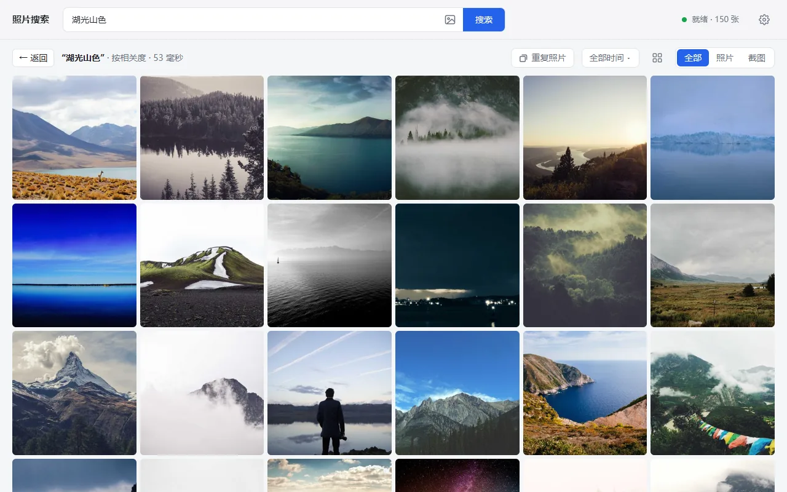

# 照片搜索（Local Photo Search）—— 基于 EmbeddingGemma 2 的本地离线 AI 以文搜图

[](https://github.com/zkwi/local-photo-search/releases/latest)
[](https://github.com/zkwi/local-photo-search/actions/workflows/ci.yml)


[](LICENSE)

[English](README.md) | 简体中文

**照片搜索**是一个免费开源的桌面应用，用一句话搜索自己电脑里的照片：输入“海边的日落”“去年5月 生日蛋糕”“聊天截图”，不到一秒就能找到对应的照片。
也可以以图搜图（把图片拖进窗口或直接粘贴，找出同一张或相似的照片），还能整理重复照片、腾出空间。
它像手机相册里的智能搜索，但所有 AI 计算都在本机完成，用的是 Google 的多模态向量模型 **[EmbeddingGemma 2](https://huggingface.co/google/embeddinggemma-2)**：照片不上传，不需要注册账号，准备好之后也不需要联网。



## 下载与运行

1. 从[最新版本](https://github.com/zkwi/local-photo-search/releases/latest)下载 `LocalPhotoSearch-<版本>-windows-x64.zip`。
2. 解压到普通文件夹，例如 `D:\Apps` 或个人文件夹（不要放在 `Program Files`，那里不能写入）。
3. 双击 **Local Photo Search.exe**。国内网络首次启动请改为双击 **Start with China mirrors.cmd**。

首次启动会自动准备好一切：先下载 Python 和 PyTorch（约 3 GB），再下载 EmbeddingGemma 2 模型（约 1.5 GB），全程显示进度。只需这一次，我们实测约 6 分钟；下载模型期间就可以先添加照片文件夹。
之后再打开，约 2 秒就能浏览照片，约 15 秒就能搜索。

程序没有代码签名，Windows 可能提示“Windows 已保护你的电脑”，点 **更多信息 → 仍要运行** 即可。

**升级**：关掉程序，把新版 zip 解压到原来的位置并覆盖旧文件。索引、设置和 Python 环境都会保留；新版需要的 Python 组件有变化时，首次启动会自动更新。

## 能做什么

- **用自然语言搜照片**：描述场景、物体、颜色或某个瞬间都可以，中文、英文等模型能理解的语言都行。结果按语义相似度排序，可只看照片或只看截图。
- **时间筛选**：搜索词里的“2025年”“去年5月”“最近一个月”“May 2025”会自动拆成时间筛选；只写时间就浏览那段时间。
- **以图搜图**：把图片拖进窗口、按 Ctrl+V 粘贴，或点搜索框里的图片按钮选一个文件。适合找别人发来的照片的原图：同一张照片排在最前，非常相似的会直接标出相似度。
- **重复照片**：按组列出完全相同的文件、几乎相同的照片（缩小或压缩过的副本，例如从微信保存的；调过色的版本；几乎没有差别的连拍）和连拍，标出建议保留的一张，以及每张的分辨率、大小和所在文件夹。程序不会删除任何照片：选中不需要的，点“在文件夹中显示”后自己删除。
- **找相似照片**、**按月浏览**；连拍和重复照片合并成一张显示，预览里可逐张查看。
- **预览**：放大看原图、幻灯片、全屏、复制图片、在文件夹中显示。
- **整理**：多选（Ctrl/Shift+点击、Ctrl+A）后复制路径、在资源管理器中显示，或导出到文件夹。
- **图库**：可添加多个文件夹，包括可能断开的 NAS 和移动硬盘；支持 JPG、PNG、WebP、BMP、HEIC；启动时自动发现新增、修改和删除的照片。
- **界面支持简体中文和英文**，跟随系统显示语言。

照片文件夹只读，导出也是复制，不会修改或移动原图。快捷键在应用里按 `?` 查看。

## 为什么用 EmbeddingGemma 2

以文搜图需要一个能把照片和句子放进同一个向量空间的模型。很多工具用 CLIP，这里选用 Google 的 EmbeddingGemma 2，因为它：

- **一个多模态模型同时编码图片和文字**，一句话可以直接和每张照片比较；
- **支持多语言**，中文搜索和英文一样好用；
- **普通电脑就能跑**：7.44 亿参数，下载约 1.5 GB，运行约占 1.5 GB 显存，没有显卡也能用 CPU；
- 采用 **Apache 2.0** 许可。

## 系统要求

- **Windows 10 或 11**，64 位，需要 WebView2（Windows 11 自带，Windows 10 会随系统更新安装），以及 PyTorch 需要的 [Microsoft Visual C++ 运行库](https://aka.ms/vs/17/release/vc_redist.x64.exe)（大多数电脑已经装过；缺的话程序会提示）。
- **显卡（可选）**：推荐 GTX 16 / RTX 20 系列或更新、显存 3 GB 以上的 NVIDIA 显卡，驱动 R580 或更新（实测加载后约占 1.5 GB，建索引时峰值约 2.4 GB）。更老的 NVIDIA 显卡和其他显卡会自动跳过，改用 CPU。
  没有也能用 CPU 运行，搜索一样快，只是第一次建索引慢一些：RTX 4080 SUPER 每张约 0.05 秒，Core Ultra 7 265K（纯 CPU）每张约 2 秒。
- **磁盘**：Python 环境约 3.3 GB，模型约 1.5 GB，索引和缩略图每千张约 30 MB。无论程序放在哪个盘，模型和 uv 的组件缓存（约 3 GB）都存在 C 盘的用户目录里。
- **网络**：只有首次启动需要。

## 常见问题

**会上传我的照片吗？** 不会。照片、缩略图和索引都只在本机。只有首次启动会联网，用来下载 Python 组件和模型。

**能离线使用吗？** 可以，首次启动下载完成后就不再需要网络。

**一定要 NVIDIA 显卡吗？** 不需要。没有显卡、或者是比 GTX 16 系列更老的 NVIDIA 显卡时用 CPU 运行，搜索照样很快，只是第一次建索引更慢（见上）。

**支持哪些语言搜索？** EmbeddingGemma 2 能理解的语言都可以，中文和英文测试得最多。界面本身支持简体中文和英文。

**国内网络首次启动很慢或失败**：用 **Start with China mirrors.cmd** 启动，它会从 npmmirror 下载 Python、从 hf-mirror.com 下载模型。Python 组件本身来自 files.pythonhosted.org 和 download.pytorch.org（download-r2.pytorch.org），如果你的网络访问不了，可以用环境变量 `HTTPS_PROXY` 设置代理。首次启动完成后就不再需要下载。

**提示“准备 Python 环境失败”**：通常是网络问题。处理好之后点提示条里的“重新启动后台服务”，已经下载过的组件不会重复下载。

**能按文字或人名找截图吗？** 模型能读出截图里的部分文字，但精确查找某个名字或数字效果有限，因为没有做 OCR。

**连拍为什么只显示一张？** 画面非常接近、拍摄时间相差 10 分钟内的照片会合并成一组，列表里每组只显示一张，点开预览可以看整组。

**会帮我删掉重复照片吗？** 不会。程序从不删除、移动或修改照片，“重复照片”只负责列出来：选中不需要的，点“在文件夹中显示”，再在资源管理器里删除（会进回收站）。“建议保留”只是按分辨率最高、其次文件最大挑的，删除前请逐组看一眼。

**以图搜图支持哪些图片？** JPEG、PNG、WebP、BMP、GIF、HEIC，50 MB 以内。图片不需要在图库里，只用于这次搜索，不会保存。

**界面语言不对**：默认跟随 Windows 的显示语言。Windows 显示语言是英文时界面也是英文，在“图库设置 → 语言”里改成简体中文即可，会记住。

## 隐私

- 照片、缩略图和索引都只保存在本机（程序文件夹里的 `index`），不会上传。
- 最近搜索只记录在本机的应用数据里，可在搜索框下拉中逐条删除。
- `index` 里的缩略图相当于照片的低清副本，`config.json` 里有照片文件夹路径，分享时不要带上这两项。
- 后台服务只接受本机的请求，程序窗口也只能加载本地内容。详情和漏洞报告方式见 [SECURITY.md](SECURITY.md)。

## 卸载

关掉程序，删除它所在的文件夹。如果还想清理共用的下载内容：删除模型缓存 `%USERPROFILE%\.cache\huggingface\hub\models--google--embeddinggemma-2` 和应用数据 `%LOCALAPPDATA%\io.github.zkwi.local-photo-search`、`%APPDATA%\io.github.zkwi.local-photo-search`；如果别的地方不用 uv，再删除它的组件缓存（`%LOCALAPPDATA%\uv`）和它安装的 Python（`%APPDATA%\uv`）。

## 从源码编译

需要 [uv](https://docs.astral.sh/uv/)、Node.js 22 或更新、Rust，以及 Tauri 需要的系统组件（Windows 上是 Microsoft C++ 生成工具和 WebView2），见 [Tauri 前置条件](https://tauri.app/start/prerequisites/)。

```powershell
git clone https://github.com/zkwi/local-photo-search.git
cd local-photo-search
cd app
npm ci
npx tauri build         # 第一次编译要几分钟
.\src-tauri\target\release\local-photo-search.exe
```

和发布包一样，程序首次启动时会用 uv 自动准备 Python 环境（也可以自己先运行 `uv sync`）。要打出和发布页一样的 zip，用 PowerShell 7 运行 `pwsh scripts/build_release.ps1`；推送 `v*` 标签时 GitHub Actions 也用它打包。

程序会从自身位置向上查找项目目录，所以整个文件夹搬到别处也能用；如果把 exe 单独复制出去，需要设置环境变量 `PHOTO_SEARCH_ROOT` 指向项目目录。

## 配置

`config.json` 在界面里修改文件夹时自动生成，也可以参照 `config.example.json` 手写：

| 字段 | 默认值 | 说明 |
| --- | --- | --- |
| `photo_dirs` | `[]` | 照片文件夹，相对路径按程序文件夹解析 |
| `index_dir` | `"index"` | 索引、缩略图和日志的位置 |
| `model` | `"google/embeddinggemma-2"` | 一般不用改；改了会重新编码全部照片 |

## 开发

```powershell
uv sync                 # 带测试工具的 Python 环境
uv run pytest           # 后端测试：不需要模型，几秒跑完
uvx ruff check          # 代码检查
cd app; npm test        # 界面文案与时间解析的测试
```

- 不经 Tauri 调试：运行 `uv run python -m backend.server`，用浏览器打开输出里 `READY` 后面的地址。
- 只建索引：`uv run python -m backend.indexer`。
- 界面文件编译在 exe 里，改了 `app/src/` 要重新 `npx tauri build`。
- 环境变量 `PHOTO_SEARCH_CONFIG` 可以指向另一份配置，例如在索引副本上测试，不影响正在用的索引。
- 新增界面语言见 [CONTRIBUTING.md](CONTRIBUTING.md)。

### 原理与取舍

- **检索**：EmbeddingGemma 2 把每张照片编码成一个 768 维向量，只做一次。搜索时把搜索词用同样的方式编码，再和所有照片的向量比较；向量常驻显存或内存，一次矩阵乘法就能给全部照片打分。
- **去偏**（`backend/calibration.py`）：截图、文档这类文字多的图片，对任何查询的分数都偏高。排序时减掉每张图对约 100 条通用描述的平均分；
  画面类查询里截图还会靠字面“蹭”上来，所以截图并不比照片更贴近时再给截图减一点分。
  在 2000 张手机照片上实测，这两步明显减少了截图对画面类查询的干扰，找截图类内容基本不受影响，具体数字见代码注释。
- **连拍分组**（`backend/grouping.py`）：相似度 ≥ 0.93 且拍摄时间相差 10 分钟内，或相似度 ≥ 0.98（同一张图的多份拷贝）。
- **重复照片**（`backend/duplicates.py`）：缩小、压缩过的副本和原图的相似度可能只有 0.83，所以“几乎相同”还要看每张缩略图的 64 位差值哈希（dHash）：相似度 ≥ 0.80 且最多相差 4 位。同一个 App 界面的截图隔几个月 dHash 也几乎一样，所以截图要求相似度 ≥ 0.98。完全相同还要求文件大小和尺寸一致。
- **以图搜图**：查询图片和图库照片用同样的方式编码，再和所有照片的向量比较（直接用余弦相似度，不做去偏）；图片只在内存里留到翻页用完。
- **启动**：先读索引库，约 2 秒就能浏览；模型加载和扫描新照片并行进行，加载完成前提交的搜索会排队，就绪后自动执行。

### 目录结构

| 路径 | 内容 |
| --- | --- |
| `backend/server.py` | FastAPI 后端：状态、浏览、搜索、以图搜图、找相似、重复照片、导出、图库设置、预览图 |
| `backend/indexer.py` | 扫描文件夹、生成缩略图、编码、dHash、写入 SQLite |
| `backend/calibration.py` | 文本搜图的去偏与截图减分 |
| `backend/grouping.py` | 连拍与重复照片分组 |
| `backend/duplicates.py` | “重复照片”：完全相同、几乎相同、建议保留哪张 |
| `backend/common.py` | 配置、模型加载、索引库 |
| `app/src/` | 界面（原生 HTML/CSS/JS），`locales/` 是各语言文案，`time.js` 解析搜索词里的时间 |
| `app/src-tauri/` | Tauri 外壳：首次运行用 uv 准备环境、启动和重启后端、单实例、记住窗口 |
| `scripts/build_release.ps1` | 打发布包（GitHub Actions 也用它） |
| `tests/`、`app/tests/` | 后端与界面测试 |

## 致谢

- [EmbeddingGemma 2](https://huggingface.co/google/embeddinggemma-2)：Google DeepMind，Apache 2.0
- [uv](https://github.com/astral-sh/uv)、[sentence-transformers](https://www.sbert.net/)、[Tauri](https://tauri.app/)、[FastAPI](https://fastapi.tiangolo.com/)、[pillow-heif](https://github.com/bigcat88/pillow_heif)
- 截图里的演示照片来自 [Unsplash](https://unsplash.com/)（经 [Lorem Picsum](https://picsum.photos/)），Unsplash 许可

## 许可证

[MIT](LICENSE)。发布包用到的第三方许可见 zip 里的 `THIRD_PARTY_NOTICES.txt`。
